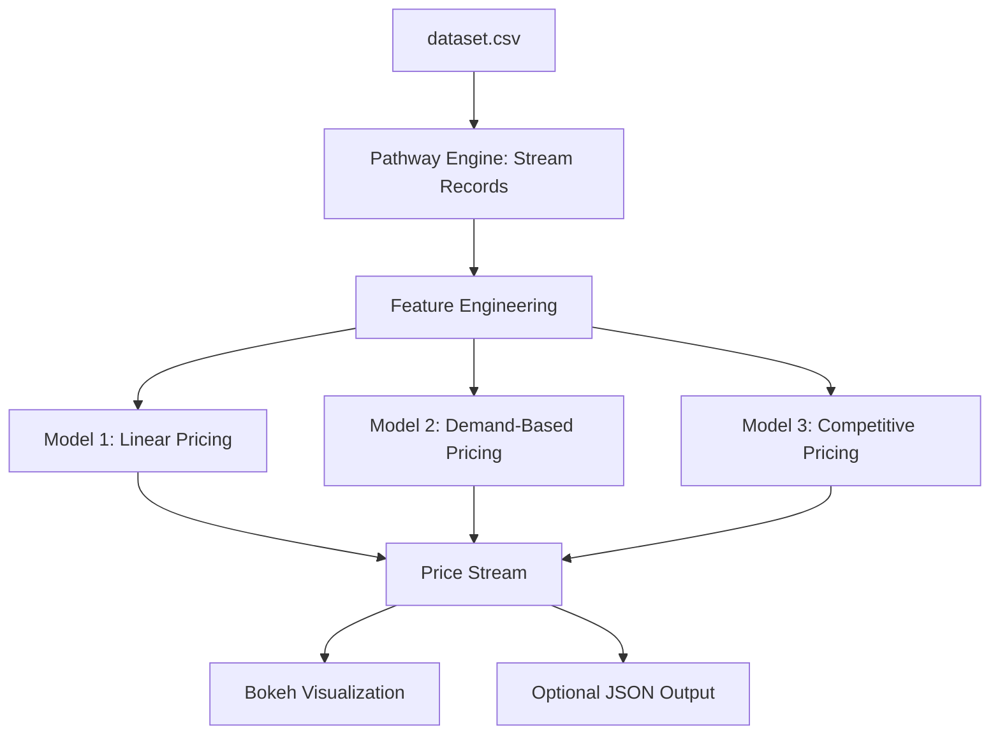
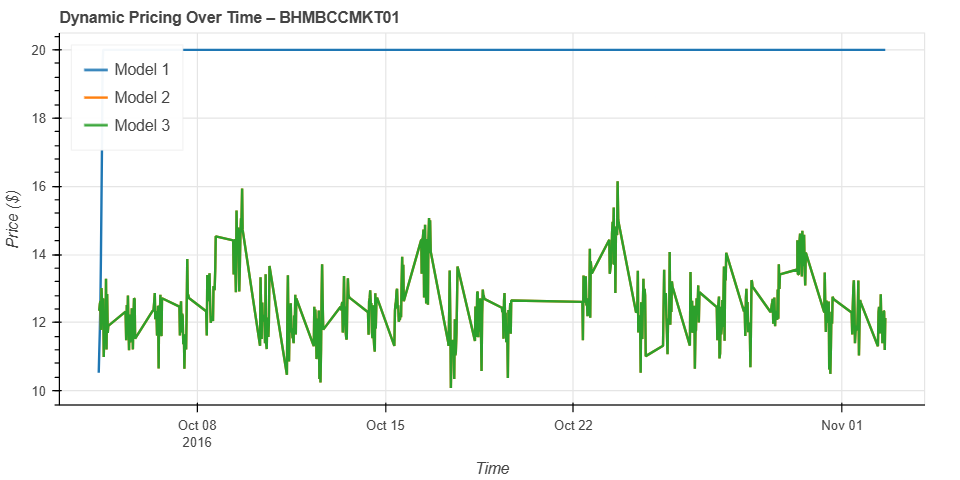

# 🚗 Dynamic Parking Pricing System

**Capstone Project | Summer Analytics 2025 | IIT Guwahati**
*By Rushi Girdharbhai Vasoya*

📂 **Current branch**: `Rushi`

---

## 🧠 Overview

A real-time parking pricing engine that dynamically adjusts prices for urban parking lots based on **demand**, **traffic**, **competition**, **vehicle types**, **events**, and more. Built using Python, streamed via **Pathway**, and visualized in real time with **Bokeh**.

---

## 🛠 Tech Stack

| Tool/Library   | Purpose                               |
| -------------- | ------------------------------------- |
| Python         | Logic, computation, data processing   |
| Pandas & NumPy | Data preprocessing and numerical work |
| Pathway        | Real-time data streaming & simulation |
| Bokeh          | Interactive real-time visualization   |
| Google Colab   | Execution environment                 |
| Mermaid        | Architecture diagrams                 |

---

## 📁 Repository Structure

```
Capstone-Project-Summer-Analytics-2025-IIT-Guwahati/
└── Rushi/
    ├── code.ipynb                # Colab notebook with streaming & pricing logic
    ├── dataset.csv              # Raw data file with lot, occupancy, traffic etc.
    ├── bokeh_plot.png           # Static image of pricing graph
    ├── problem statement.pdf    # Original problem definition
    ├── Capstone Project.docx    # Detailed project report
    └── README.md                # This file
```

---

## 📐 Project Architecture



---

## ⚙️ Project Workflow

1. **Load & preprocess** dataset: fill missing, normalize, encode features.
2. **Stream records** via Pathway in chronological order.
3. **Apply pricing models**:

   * **Model 1**: Simple linear based on occupancy.
   * **Model 2**: Demand model (occupancy + queue + traffic + events + vehicle type).
   * **Model 3**: Market-aware model (Haversine distance + competitor price adjustments).
4. **Clamp prices** between \$5 and \$20 to ensure fairness.
5. **Visualize** in real time with Bokeh (per-lot, multi-model comparisons).

---

## 🔍 Live Pricing Demo

This is the output for parking lot **BHMBCCMKT01**, showing all three models over time:



**Highlights**:

* 🔵 *Model 1* stays flat (baseline).
* 🧾 *Model 2* responds to demand factors.
* 🟢 *Model 3* introduces realistic fluctuations via competition.

---

## ▶️ How to Run

1. Clone this repository and switch to `Rushi`:

   ```bash
   git clone https://github.com/Rucyvar/Capstone-Project-Summer-Analytics-2025-IIT-Guwahati.git
   cd Capstone-Project-Summer-Analytics-2025-IIT-Guwahati
   git checkout Rushi
   ```
2. Open `code.ipynb` in Google Colab.
3. Upload `dataset.csv` and run all notebook cells.
4. Visualize dynamic pricing output inline with Bokeh.

---

## ✨ Key Features

* 🛁 Real-time simulation using Pathway
* 📊 Multi-model pricing (occupancy, demand, competition)
* 🌍 Competitor-aware pricing via spatial logic
* 🔄 Smooth, bounded price transitions
* 📈 Interactive and comparative plots with Bokeh

---

## 📊 Model Comparison Summary

| Feature              | Model 1 | Model 2 | Model 3 |
| -------------------- | ------- | ------- | ------- |
| Occupancy-Based      | ✅       | ✅       | ✅       |
| Queue Length         | ❌       | ✅       | ✅       |
| Traffic Sensitivity  | ❌       | ✅       | ✅       |
| Special Events       | ❌       | ✅       | ✅       |
| Vehicle Type Impact  | ❌       | ✅       | ✅       |
| Competitor Awareness | ❌       | ❌       | ✅       |
| Rerouting Suggestion | ❌       | ❌       | ✅       |

---

## 📄 Documentation & Reports

* 📝 **Problem Statement**: `problem statement.pdf`
* 📘 **Final Report**: `Capstone Project.docx`
* 🧪 **Colab Code**: `code.ipynb`

---

## 🚀 Next Steps & Future Work

* 📌 Optimize model weights with ML or regression analysis
* 🔗 Integrate real-time traffic/event APIs (e.g. Google Maps, Ticketmaster)
* 🤖 Explore reinforcement learning for adaptive pricing
* 📱 Develop a web/mobile dashboard for user interaction
* ☁️ Scale simulation to a larger city-wide infrastructure

---

## 📌 Contact

**Rushi Girdharbhai Vasoya**
📧 [rushivasoya.coder@gmail.com](mailto:rushivasoya.coder@gmail.com)

---
